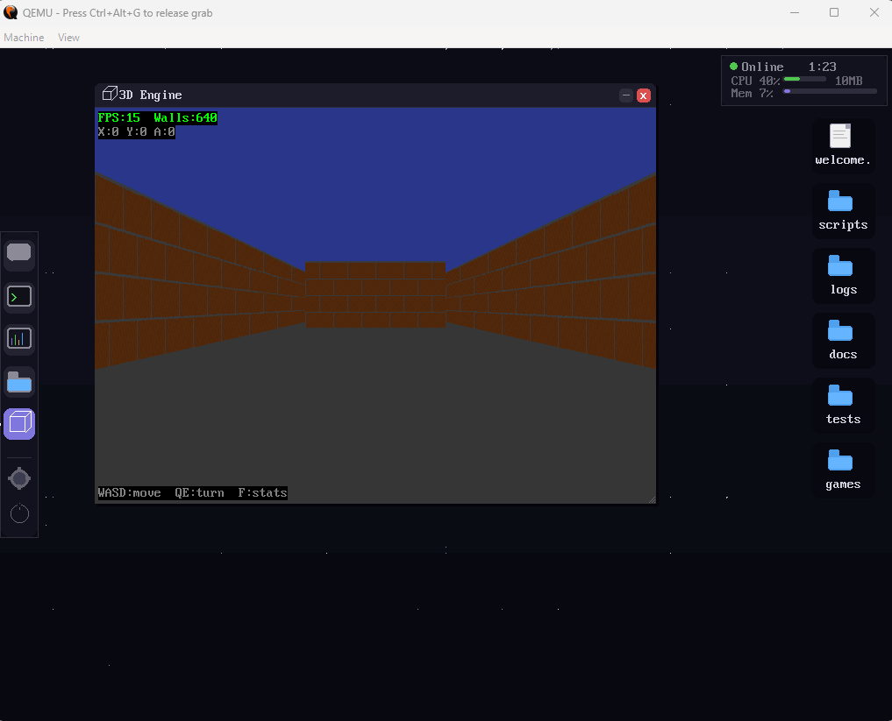

# CLAOS — Claude Assisted Operating System

```
   ####  ##        ##     ####    ####
  ##     ##       ####   ##  ##  ##
  ##     ##      ##  ##  ##  ##   ####
  ##     ##      ######  ##  ##      ##
   ####  ######  ##  ##   ####   ####

  "I am the kernel now."
```

**CLAOS** (pronounced "Chaos") is a toy x86 operating system written entirely from scratch with **zero dependency on any existing OS kernel**. No Linux, no Windows, no macOS, no GRUB, no libc — just raw metal and vibes.

CLAOS is an **AI-native OS** where Claude (Anthropic's AI) is integrated at the kernel level as a core system service. Claude can be prompted interactively from the OS shell, receives crash/panic reports automatically, and can send back diagnoses in real time. All over **native HTTPS** — no relay scripts, no middleware.

> This is a meme project and educational toy — not a production OS. Built with Claude Code.

### Boot Screen


### Kernel Panic


### 3D Engine (Not Doom)


---

## Features

### Phase 1 — Boot & Kernel Foundation
- Custom 2-stage bootloader (MBR → Protected Mode), no GRUB
- 32-bit protected mode kernel in C and x86 assembly
- VGA text mode driver (80x25, color, scrolling)
- PS/2 keyboard driver with shift support and line editing
- PIT timer (100 Hz), full interrupt infrastructure (GDT, IDT, PIC, ISR/IRQ)
- Kernel panic handler with dramatic red screen and register dump

### Phase 2 — Memory Management & Scheduler
- Bitmap-based physical memory manager with E820 memory map parsing
- Virtual memory with 4GB identity-mapped paging via PSE
- First-fit kernel heap allocator (`kmalloc`/`kfree`)
- Preemptive round-robin scheduler with context switching via timer IRQ

### Phase 3 — Network Stack
- PCI bus enumeration, Intel e1000 NIC driver with DMA descriptor rings
- Full TCP/IP stack: Ethernet → ARP → IPv4 → UDP → DNS → TCP
- DNS resolution, TCP state machine with sequence tracking

### Phase 3.5 — TLS via BearSSL
- BearSSL (294 source files) ported to freestanding i686
- Entropy pool (RDTSC + timer ticks), TLS 1.2 handshake with Anthropic's servers
- Custom X.509 engine for server certificate key extraction

### Phase 4 — HTTPS Client & Claude Integration
- HTTP/1.1 over TLS with chunked transfer encoding
- Claude protocol layer: JSON request building + response parsing
- Runtime API key configuration via interactive `config` command
- Panic-to-Claude: kernel crashes auto-send reports to Claude for AI diagnosis

### Phase 5 — ClaudeShell
- AI-first shell: unrecognized commands automatically sent to Claude
- `claude <msg>` to talk to Claude, or just type anything

### Phase 6 — ChaosFS Custom Filesystem
- **ChaosFS** — custom from-scratch filesystem with long filenames (108 chars)
- ATA/IDE PIO driver for disk I/O
- Contiguous block allocation, superblock + file table design
- 64MB disk image with persistent storage across reboots
- Shell commands: `dir`, `read`, `write`, `mkdir`, `del`, `disk`
- Build system preserves filesystem data across kernel rebuilds

### Phase 7 — Embedded Lua 5.5
- **Lua 5.5** ported to freestanding i686 (32 source files compiled into kernel)
- Full compatibility shim: malloc/realloc/free, math, stdio, time, setjmp/longjmp
- **`claos.*` API bindings** — talk to Claude, read/write files, system info from Lua
- Interactive Lua REPL (`lua` command) and script execution (`lua <file>`)
- Inline Lua execution (`luarun <code>`)
- Pre-installed scripts on ChaosFS: `/scripts/hello.lua`, `/scripts/chat.lua`

### Phase 8 — GUI Desktop & Audio
- **VESA framebuffer** graphics with Lua-driven desktop environment
- Floating window manager with draggable, resizable windows
- App framework: terminal emulator, file browser, notepad viewer
- PS/2 mouse driver with cursor rendering and click events
- Shared widget system (buttons, text fields, scroll bars)
- **AC97 audio driver** — DMA ring buffer playback with sine wave tone generation
- Intel 82801AA codec support via PCI bus master I/O

### Phase 9 — 3D Engine (Current)
- **BSP software 3D renderer** — Doom-style column-based rendering, all CPU, no GPU
- 16.16 fixed-point math with pre-generated 4096-entry trig lookup tables
- BSP tree front-to-back traversal with per-column occlusion culling
- Perspective-correct texture mapping (1/z interpolation) with sub-pixel anchoring
- Procedural textures (brick, stone, checkerboard), CTX texture file format
- 32-level lighting LUT with distance-based dimming
- 2D collision detection with wall sliding
- **Game input system** — scancode key state polling, mouse raw delta mode for FPS
- Lua API: `claos.gui3d.*` (camera, viewport, render, textures, sprites, collision)
- Renders into any viewport — works fullscreen or inside desktop GUI windows
- Host tools: BSP compiler (`bspbuild.py`), trig table generator (`gen_trig.py`)

## Shell Commands

| Command | Description |
|---------|-------------|
| `claude <msg>` | Ask Claude a question |
| `config` | Configure API key & model |
| `dir [path]` | List files |
| `read <file>` | Display file contents |
| `write <f> <d>` | Write data to file |
| `mkdir <path>` | Create directory |
| `del <file>` | Delete file |
| `disk` | Show ChaosFS disk usage |
| `lua` | Open Lua REPL |
| `lua <file>` | Run a Lua script |
| `luarun <code>` | Execute inline Lua |
| `sysinfo` | System information |
| `tasks` | List running tasks |
| `net` | Network configuration |
| `dns <host>` | Resolve a hostname |
| `tls` | Test TLS handshake |
| `uptime` | System uptime |
| `clear` | Clear screen |
| `panic` | Trigger a kernel panic |
| `reboot` | Reboot the system |
| `gui` | Open GUI desktop |
| *anything else* | *Sent to Claude automatically* |

## Roadmap

| Phase | Status | Description |
|-------|--------|-------------|
| 1 | **Done** | Boot & Kernel Foundation |
| 2 | **Done** | Memory Management & Scheduler |
| 3 | **Done** | Network Stack (TCP/IP) |
| 3.5 | **Done** | TLS via BearSSL |
| 4 | **Done** | HTTPS Client & Claude Integration |
| 5 | **Done** | ClaudeShell |
| 6 | **Done** | ChaosFS Custom Filesystem |
| 7 | **Done** | Embedded Lua 5.5 Scripting |
| 8 | **Done** | GUI Desktop & AC97 Audio |
| 9 | **Active** | BSP 3D Engine |

---

## Building

### Prerequisites

- **i686-elf-gcc** — freestanding cross-compiler ([pre-built](https://github.com/lordmilko/i686-elf-tools/releases))
- **NASM** — x86 assembler
- **QEMU** — `qemu-system-i386`
- **GNU Make** + **Python 3** (for ChaosFS disk tool)

### Build & Run

```bash
make            # Build kernel and update disk image (preserves ChaosFS data)
make newdisk    # Recreate disk image from scratch (formats ChaosFS)
make clean      # Remove build artifacts (keeps disk image)
make fullclean  # Remove everything including disk image
```

On Windows, double-click **`run.bat`** to launch CLAOS in QEMU.

### Claude API Setup

Either edit `claude/config.h` with your API key before building, or use the `config` command at the CLAOS shell prompt to enter it at runtime.

---

## Architecture

```
┌──────────────────────────────────────────────────┐
│                  CLAOS Stack                      │
├──────────────────────────────────────────────────┤
│  BSP 3D Engine + GUI Desktop (Lua + VESA)          │
├──────────────────────────────────────────────────┤
│  ClaudeShell (AI-first interactive shell)          │
├──────────────────────────────────────────────────┤
│  Claude Protocol + HTTPS (JSON over TLS 1.2)      │
├──────────────────────────────────────────────────┤
│  ChaosFS + Network Stack                          │
│  (ATA/IDE, TCP/IP, DNS, BearSSL)                  │
├──────────────────────────────────────────────────┤
│  Kernel (GDT, IDT, PMM, VMM, heap, scheduler)    │
├──────────────────────────────────────────────────┤
│  Drivers (VGA, PS/2, PIT, PCI, e1000, AC97)        │
├──────────────────────────────────────────────────┤
│  Bootloader (MBR → Protected Mode → 1MB kernel)  │
└──────────────────────────────────────────────────┘
```

---

## Key Constraints

- **No existing OS code** — no Linux headers, no glibc, no POSIX
- **No bootloader frameworks** — no GRUB, hand-written bootloader
- **No relay or middleware** — native HTTPS directly to api.anthropic.com
- **Freestanding C** — `-ffreestanding -nostdlib -fno-builtin`
- **Everything from scratch** — custom `memcpy`, `strlen`, TCP/IP stack, filesystem, the works

---

## License

This is a meme project. Do whatever you want with it. Have fun.

---

*Built with [Claude Code](https://claude.ai) — because every OS deserves an AI copilot.*
